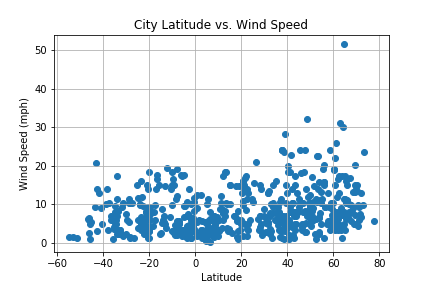
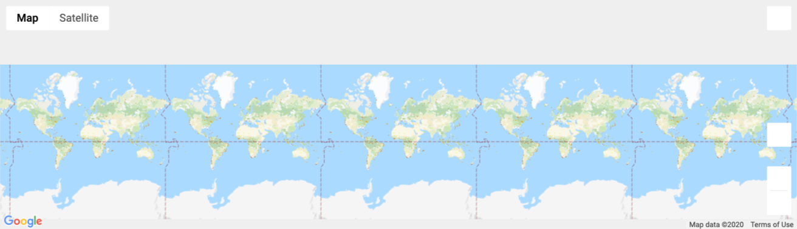
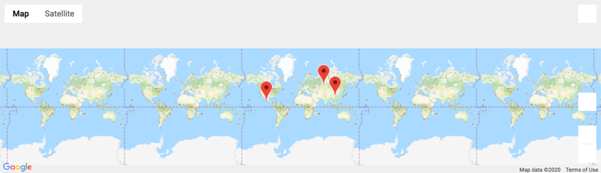

# API-Challenge

## Part I-WeatherPy

A Python script was created to visualize the weather of 500+ cities across the world of varying distance from the equator using weather map API. 

A series of scatter plots were created to display the following information:
* Temperature (F) vs. Latitude
* Humidity (%) vs. Latitude
* Cloudiness (%) vs. Latitude
* Wind Speed (mph) vs. Latitude

Same plots above were seprated into Northern Hemisphere and Southern Hemisphere then linear regression was calculated for each plot: 
*	Northern Hemisphere - Temperature (F) vs. Latitude
*	Southern Hemisphere - Temperature (F) vs. Latitude
*	Northern Hemisphere - Humidity (%) vs. Latitude
*	Southern Hemisphere - Humidity (%) vs. Latitude
*	Northern Hemisphere - Cloudiness (%) vs. Latitude
*	Southern Hemisphere - Cloudiness (%) vs. Latitude
*	Northern Hemisphere - Wind Speed (mph) vs. Latitude
*	Southern Hemisphere - Wind Speed (mph) vs. Latitude

## Part II-VacationPy

Jupyter-gmaps, and Google Places API was utilized to create a heat map that displays the humidity for every city from the part I.

In addition, a DataFrame was created to identify locations around the world with perfect weather conditions:
*	A max temperature lower than 80 degrees but higher than 70.
*	Wind speed less than 10 mph.
*	Zero cloudiness.

